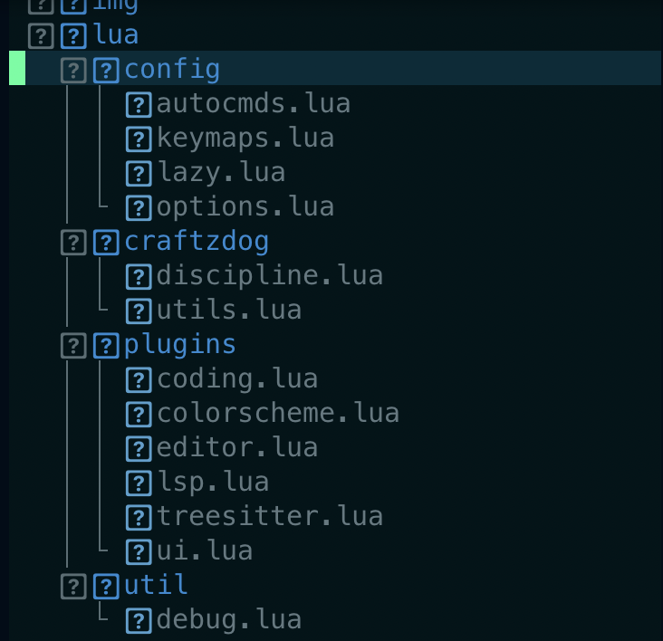

<h1>Customized Lazy-NeoVim</h1>




<h3>Bring it locally...</h3>

<h4>Mac</h4>

```plaintext
brew install neovim
```

<h4>Debian</h4>

```plaintext
sudo apt install neovim
```

<spam>below steps are same for all linux users</spam>

```plaintext
cd ~/.config
```

```plaintext
mkdir nvim
```

```plaintext
cd nvim
```

```plaintext
git clone https://github.com/barat-ssh/Lazy-vim.git
```

```plaintext
rm -rf img
```

```plaintext
nvim
```

<spam>Give it some time to install plugins</spam>

<h2><i>Thanks...</i></h2>
<i> Please feel free to contribute!, Thanks <a href="https://twitter.com/_barat_tw">@_barat</a></i>
